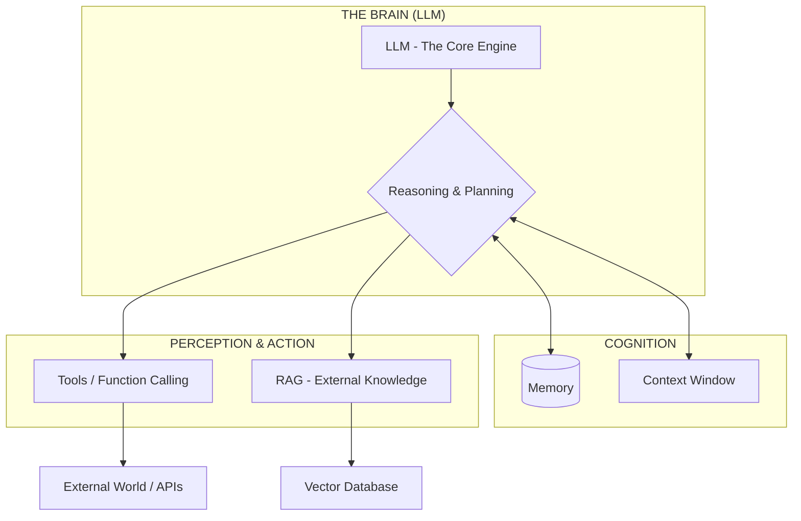

### What is Agentic AI

An autonomous system powered by an LLM
that can perceive its environment, reason
about tasks, and take actions using tools to
achieve specific goals. Unlike standard
chatbots, agents can follow multi-step plans.

breaks down the essential components of AI Agent architecture, from the core "brain" to advanced multi-agent coordination.

1. The Core Engine (Foundations)

LLM (Large Language Model): The central reasoning engine that serves as the "brain" for the agent.  

Token: The fundamental unit of text (words or fragments) that the model processes.  

Temperature: A setting that controls output randomness; low values are deterministic, while high values increase creativity.  

Context Window: The total capacity of information (tokens) an agent can process in a single "thought" or interaction.  

2. Cognition & Knowledge (Memory)

Short-term Memory: Retains information from the immediate, ongoing conversation within the context window.  

Long-term Memory: Uses external databases to store and recall information across different sessions.  

RAG (Retrieval-Augmented Generation): A framework that enables the agent to pull specific, factual data from external knowledge bases or documents to ground its answers.  

3. Capability & Action (The "Hands")

Tools / Function Calling: The mechanism that allows agents to interact with external software, such as searching the web, running code, or calling APIs.  

AI Agent: A system that uses an LLM to autonomously plan, use tools, and complete multi-step tasks to reach a goal.  

4. System Architecture & Workflows

Agent Workflow: The iterative cycle of Plan → Act → Observe → Refine that agents follow to solve problems.  

Multi-Agent Systems: Collaborative environments where multiple specialized agents (e.g., a "Coder" and a "Reviewer") work together.  

A2A Protocol (Agent-to-Agent): Standardized communication rules that allow different agents to exchange information and delegate tasks

