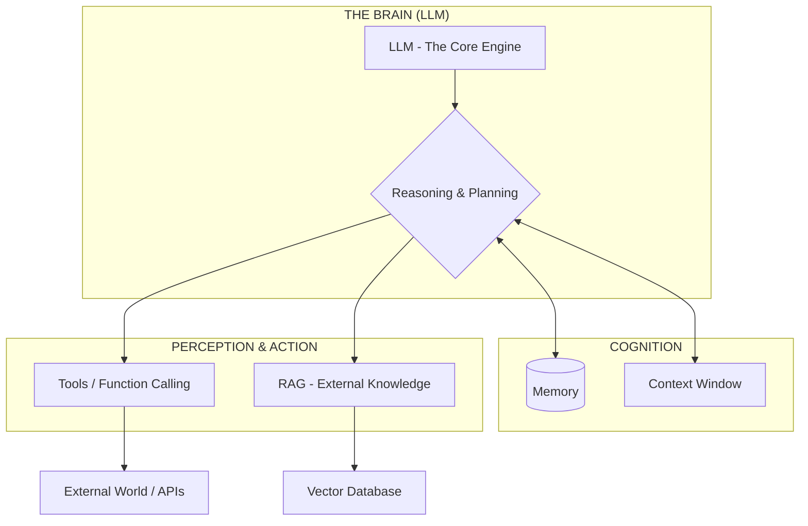

### What is Agentic AI

An autonomous system powered by an LLM
that can perceive its environment, reason
about tasks, and take actions using tools to
achieve specific goals. Unlike standard
chatbots, agents can follow multi-step plans.

### important concept around agentic ai

- Prompts
- Tokens
- Content Window
- Tempreture
- RAG
- Function Calling
- MCP
- Agent workflow

### Agentic Pattern

### Agentic workflow Pattern

### RAG Pattern

